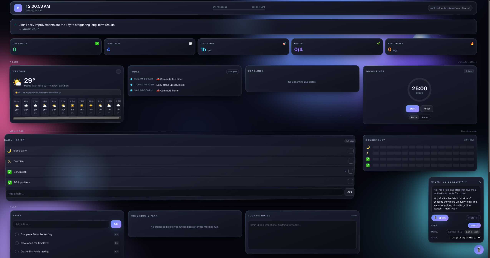

# Orbit

[](LICENSE) [](CONTRIBUTING.md) [](https://github.com/Saathvik-Choudhary/Personal_Dashboard/discussions)

🔗 **[Live demo →](https://travel-like-ap.web.app)**



A personal command center on a Firestore core, with a shared Claude intelligence layer. Built
from [`orbit-build-spec.md`](orbit-build-spec.md). Everything reads and writes Firestore; two
compute layers act on it (always-on Cloud Functions + a 4–9am Mac daemon), and the dashboard is a
thin client over the same data.

**Stack:** TypeScript · Next.js 14 (App Router, PWA) · Firebase (Firestore, Auth, Cloud Functions
2nd gen, Hosting) · Anthropic Claude · Tailwind CSS · pnpm workspaces + Turborepo · Twilio
(WhatsApp) · Google Calendar API.

## What's in this repo

```
orbit/
├─ apps/dashboard/        Next.js 14 PWA — the UI surface (thin client over Firestore)
├─ functions/            Firebase Cloud Functions (2nd gen) — always-on cheap delivery + approval
├─ daemon/               Mac M1 local daemon — token-heavy Claude jobs, 4–9am window
├─ packages/core/        THE shared module — Claude calls, Firestore, jobs, domain types
├─ firestore.rules       User-scoped security rules
├─ firestore.indexes.json Composite indexes (reminder scan, task/event views)
├─ firebase.json         Hosting + Functions + Firestore + emulator config
├─ pnpm-workspace.yaml / turbo.json
```

The high-leverage boundary is **`packages/core`** — both the daemon and the functions import it,
and a future project #2 imports the same package and points it at new collections. The
intelligence layer is never rebuilt per project. Protect that boundary.

### Model choices (per-job, by design — spec §6)

- **News digest** → `claude-sonnet-4-6` (routine summarization; cheaper/faster).
- **Calendar planning** → `claude-opus-4-8` (reasoning quality matters). Switching the model is a
  one-line change per job in `packages/core/src/jobs/`.

The Anthropic key is read from the environment only and never reaches the client. All Claude calls
happen in the daemon or in functions.

## Build status

| Layer | State |
|---|---|
| Monorepo, Firestore rules/indexes, `firebase.json`, secrets `.gitignore` | ✅ complete (Phase 0) |
| `packages/core` — types, Claude client, prompts, jobs, repositories, delivery, calendar | ✅ complete |
| `daemon` — 4–9am window, idempotency, hourly-retry, job runners, launchd agent | ✅ complete (Phase 2 logic) |
| `functions` — scanReminders, morningBundle, onEventConfirmed, approveProposal, refreshCalendar | ✅ complete (Phase 3/4 logic) |
| `apps/dashboard` — sign-in, today view, tasks, digest (with fallback), proposal approve | ✅ functional MVP (Phase 1) |

The **code** is complete and internally consistent. What remains is wiring it to *your* external
accounts (Firebase project, Anthropic key, Twilio sender, Google OAuth) — none of which can be
provisioned from a repo. Steps below.

## Bring it online

### 0. Prerequisites
- Node 20+, `pnpm` (`corepack enable && corepack prepare pnpm@latest --activate`)
- `firebase-tools` (`pnpm add -g firebase-tools`), then `firebase login`
- A Firebase project with Firestore (native mode) + Authentication (Google provider) enabled

### 1. Install & build the shared core
```bash
pnpm install
pnpm --filter @orbit/core build   # every other package depends on this
```

### 2. Configure secrets
```bash
cp .env.example .env               # fill in the values; .env is gitignored
```
- Cloud secrets go in **Secret Manager** (used by functions at deploy):
  ```bash
  firebase functions:secrets:set ANTHROPIC_API_KEY
  firebase functions:secrets:set TWILIO_ACCOUNT_SID   # …and the rest from .env.example
  ```
- Daemon secrets: put the Firebase **service-account JSON** at `secrets/service-account.json`
  (gitignored) and set `ANTHROPIC_API_KEY` + `ORBIT_USER_UID` in `daemon`'s environment.

### 3. Deploy Firestore rules + indexes
```bash
firebase deploy --only firestore:rules,firestore:indexes
```

### 4. Dashboard (Phase 1)
Fill the `NEXT_PUBLIC_FIREBASE_*` web config in `.env`, then:
```bash
pnpm --filter @orbit/dashboard dev      # http://localhost:3000
# deploy: firebase deploy --only hosting
```
Sign in with Google, add tasks, watch them live on Firestore.

### 5. Functions (Phase 3/4)
```bash
pnpm --filter @orbit/functions build
firebase deploy --only functions
```
This schedules `scanReminders` (every 5 min), `morningBundle` (~7am), `refreshCalendar`
(every 15 min) and wires the `onEventConfirmed` trigger + `approveProposal` callable.

### 6. Daemon (Phase 2)
```bash
pnpm --filter @orbit/daemon build
ORBIT_USER_UID=<your-uid> node daemon/dist/index.js --force   # test outside the window
```
Then install the launchd agent (edit the `USER` paths first):
```bash
cp daemon/launchd/com.orbit.daemon.plist ~/Library/LaunchAgents/
launchctl load ~/Library/LaunchAgents/com.orbit.daemon.plist
sudo pmset repeat wake MTWRFSU 03:58:00     # request hardware wakes (belt + suspenders)
```

### 7. Google Calendar (Phase 4)
Create an OAuth2 client (Web), set the redirect URI in `.env`, complete the consent flow to get a
**refresh token with offline access**, and store it encrypted (Secret Manager for now;
`functions/src/calendarAuth.ts` is the single swap point for a KMS/encrypted-Firestore store).

## Open questions to settle (spec §17)
- Which exact RSS feeds/topics for the digest (defaults are in `packages/core/src/news/sources.ts`).
- Dashboard rendering: static export vs SSR.
- Per-user encrypted refresh-token store for `calendarAuth.ts`.
- Inbound WhatsApp quick-capture (out of scope for v1; the delivery layer doesn't preclude it).

## Bootstrapping the user profile
Before the daemon runs, the user doc must exist (`users/{uid}`). Minimal shape:
```json
{
  "timezone": "America/Los_Angeles",
  "workingHours": { "start": "09:00", "end": "17:00" },
  "reminderChannels": ["push"],
  "newsTopics": ["AI", "startups"],
  "pushTokens": [],
  "calendar": { "connected": false }
}
```
Create it from the Firestore console or a one-off script using the Admin SDK.

## Security & secrets
No credentials are committed to this repository. All secrets live outside version control:

- **`.env`** (real values) is gitignored — only [`.env.example`](.env.example), with empty
  placeholders, is tracked. Copy it to `.env` and fill in your own values.
- **Server secrets** (Anthropic, Twilio, Google OAuth) belong in Google Secret Manager for
  functions and in the daemon's environment / macOS Keychain — never in source.
- **Service-account JSON, private keys, certificates and tokens** are blocked by
  [`.gitignore`](.gitignore).
- The `NEXT_PUBLIC_FIREBASE_*` web config is public by design (Firebase web keys are not secrets);
  access is gated by Firestore security rules, not by hiding the config.

If you fork this repo, rotate any key you ever paste locally and confirm `git status` never lists
`.env` before pushing.

## 💬 Feedback & Contributing

This project is actively evolving and **your opinion matters**. You don't have to write
code to help — telling me what you think is the most valuable thing you can do.

- 💡 [Share feedback or an idea](https://github.com/Saathvik-Choudhary/Personal_Dashboard/issues/new?template=feedback.md)
- 💬 [Start a Discussion](https://github.com/Saathvik-Choudhary/Personal_Dashboard/discussions) — questions, ideas, first impressions
- 🐞 [Report a bug](https://github.com/Saathvik-Choudhary/Personal_Dashboard/issues/new?template=bug_report.md)
- ⭐ Star the repo if you find it useful — it helps others discover it

See [CONTRIBUTING.md](CONTRIBUTING.md) for the full guide.

## License

Released under the [MIT License](LICENSE). © 2026 Saathvik Choudhary.
